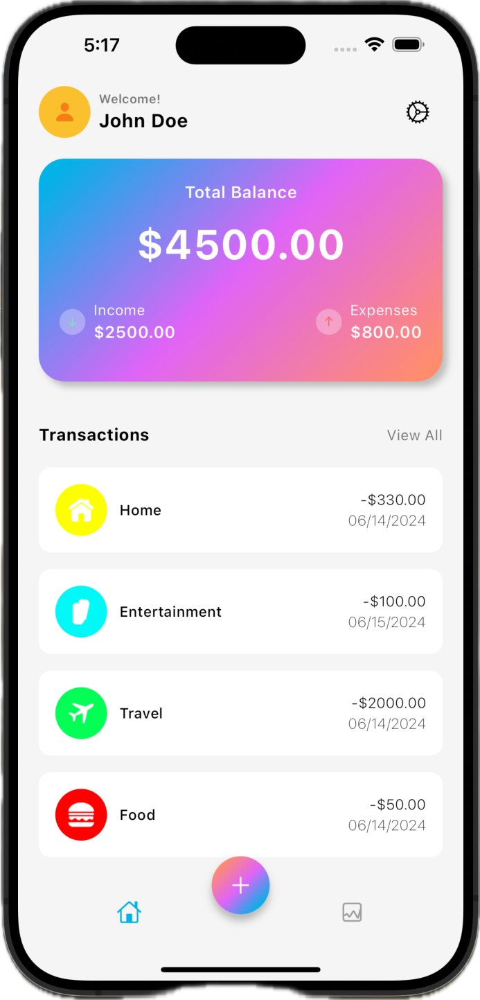
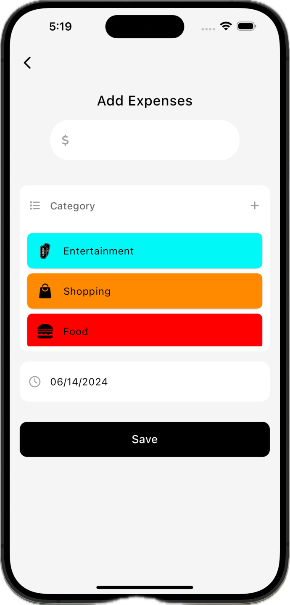
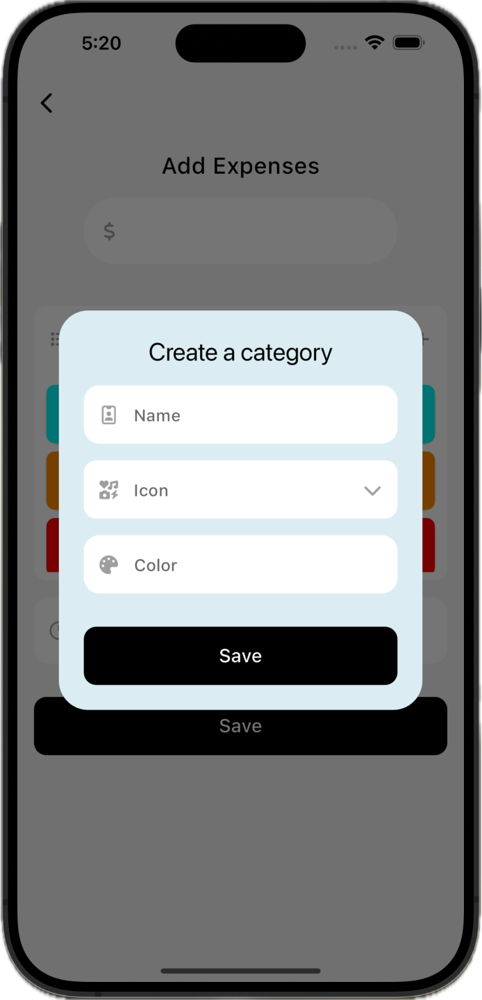
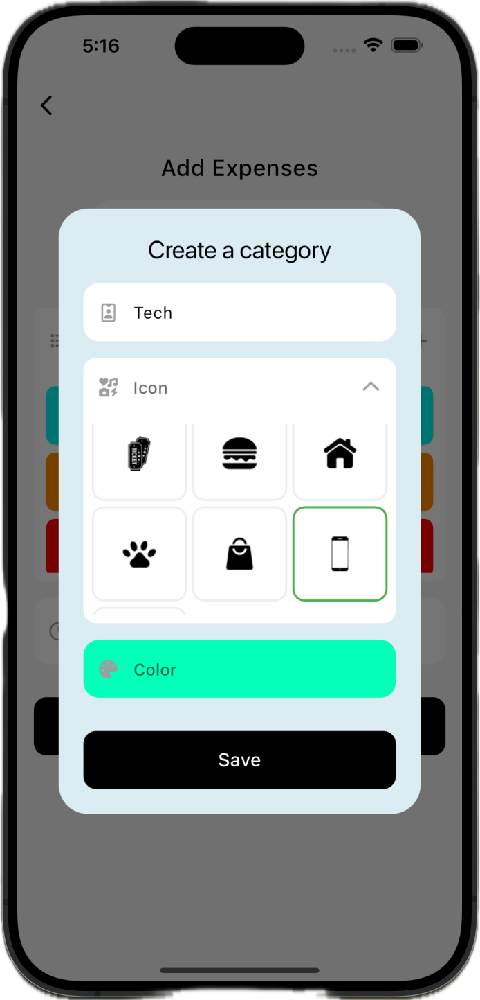
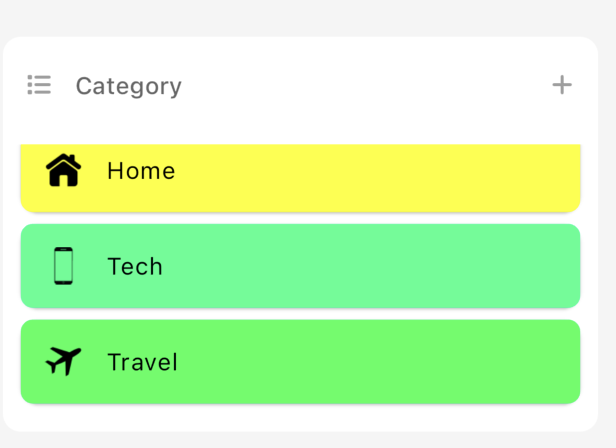
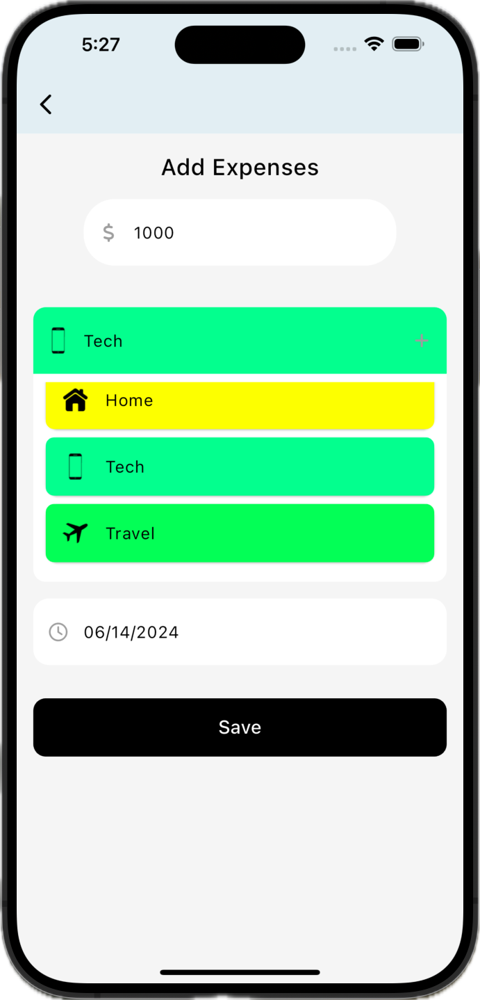
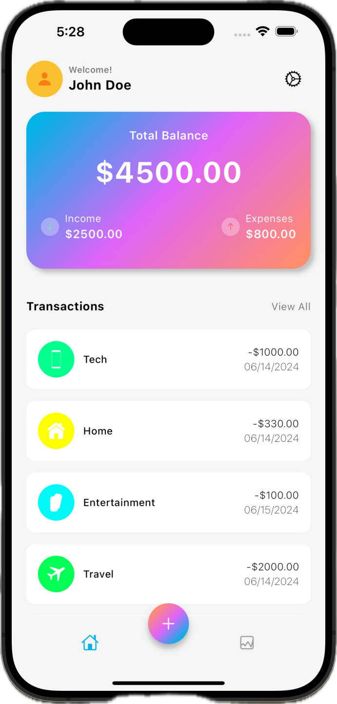
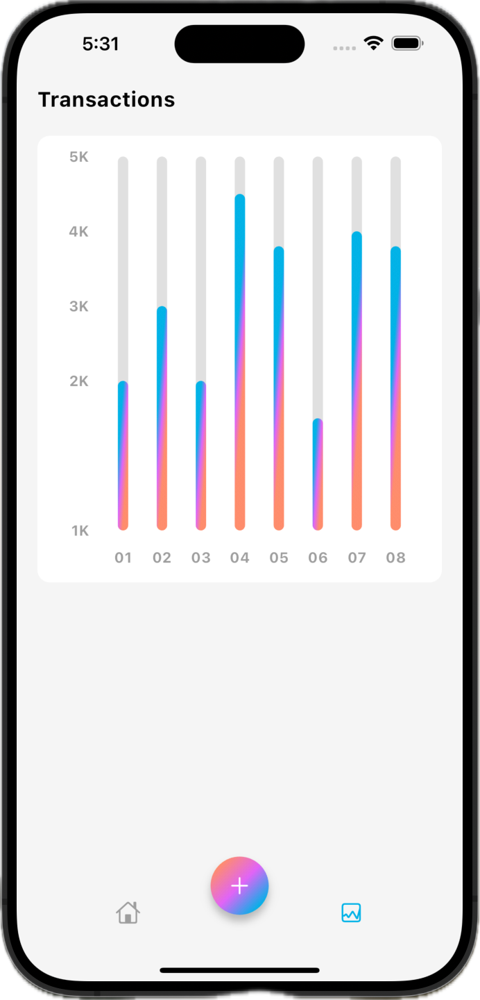

# Flutter Expense Tracker App

A simple Flutter Expense Tracker app that lets users to add and track their categorized expenses, such as Entertainment, Travel, Food, and so on.


## Table of Contents

1. [Getting Started](#getting-started)
    - [Prerequisites](#prerequisites)
    - [Installation](#installation)
2. [Usage](#usage)
    - [Home Screen](#home-screen)
    - [Adding Expenses](#adding-expenses)
3. [Next Steps](#next-steps)
4. [Contributing](#contributing)
5. [Contact](#contact)
6. [Credits](#credits)


## Features

* User interface built with Flutter for a smooth and responsive experience.
* Ability to add and track expenses - categorized and dated for easier tracking.

## Getting Started

These instructions will help you set up and run the Flutter application locally on your device.

### Prerequisites

- **Flutter SDK:** Make sure you have Flutter installed on your system. You can follow the
  instructions [here](https://flutter.dev/docs/get-started/install) to install Flutter.
- **IDE:** Choose an IDE for Flutter development. Popular choices include Android Studio, Visual
  Studio Code, and IntelliJ IDEA.
- **Git:** Make sure you have [Git](https://git-scm.com/) installed on your device to clone the
  repository. (This step is optional, in case you are downloading the ZIP file or not contributing
  to the repository).


### Installation

**NOTE: Install the Flutter SDK first.**

- If you haven't installed Flutter SDK yet, download it from the
  official [Flutter website](https://docs.flutter.dev/get-started/install).
- Extract the downloaded ZIP file to a location on your computer.
- Add the ```flutter/bin``` directory to your system's PATH to      access the Flutter commands globally.

<br>

1. **Clone this repository:**

    Open your terminal or command prompt and navigate to a directory (If running this app on an iOS device, make sure you clone this repository to a directory that does not sync with the cloud, such as the ```Downloads``` directory) where you want to clone the
    repository. Then, run the following command:

   ```bash
   git clone https://github.com/NehangPatel23/flutter-expense-tracker.git
   ```

<br>

2. **Navigate to the project directory and install the dependencies:**

    Flutter projects have certain dependencies that need to be installed before the application can be
    run. In the project directory, run the following command to install the dependencies specified in
    the ```pubspec.yaml``` file:

    ```bash
    cd flutter-expense-tracker
    flutter pub get
    ```

3. **Open the project in your IDE.**

    Open your chosen IDE and open the project directory. You can install the Flutter and Dart extensions
    for a smoother development experience.
    
    For example, if you're using Visual Studio Code, you can open the project by running:

    ```bash
    code .
    ```

4. **Connect a physical device or start an emulator.**

    Ensure that you have either a physical device connected via USB debugging or an emulator running. You can use any device - iOS or Android.

    Note: For iOS devices, the minimum required version to properly run the application is iOS 12.


3. **Run the app:**

    Run the following command to build and launch the app on your connected device or emulator.

    ```bash
    flutter run
    ```


## Usage

***Note: This project currently just focuses on creating the UI and implementing basic dynamic features such as the Transactions List correctly. The app still lacks features such as authentication, adding income to the transactions list, dynamic balance card, etc., which I will implement later.***

### Home Screen

Once you launch the application on your emulator, you will see the following Home Screen:



The app simulates the expenses for a test user, John Doe.

The Balance Card shows the current balance for the said user, their income and their total expenses.

Below the Balance Card is the Transactions List, that shows all of the user's recent transactions in the form of categories, such as Entertainment, Travel, Food, etc., along with the date on which the transaction occured.

<br>

### Adding Expenses

Clicking on the round ```+``` button next to the ```Home``` button on the bottom navigation bar takes the user to the 'Add Expenses' page:



Here, the user can add expenses they make and categorize them using the various categories displayed under the 'Categories' menu. 

If they are not satisfied with the categories mentioned here, they also have the option to create a new category by clicking the '+' icon on the right side of the Category menu:



Here is how this feature works:
    - The user adds a name to the Category, for example, ```Tech```.
    - The user then adds a phone icon to depict the Tech category.
    - Lastly, they add a unique color to identify the category.

This is how the screen would look once they do that:



The newly created category shows up under the Category menu on the previous page:



Now, let's add an expense: Say the user spent $1000 on a laptop today, 14 June 2024.

This is how they would enter it in the app:



Once they click on 'Save', this expense gets added to the Transactions List on the Home Screen:




That's how a user would typically add an expense in the app.

The 'Stats' menu would show the transaction statistics like the spending patterns, which would be depicted as a graph like this:



Again, that is a feature which I still need to implement.


## Next Steps

These are the next steps to improve the app:

- Implement the authentication system to enable the user to sign-in and sign-out of the app.
- Make the Balance Card dynamic.
- Add the 'Income' feature to keep track of any income the user wants to log.
- Implement the statistics menu.


## Contributing

Contributions are welcome! If you'd like to contribute to this project, feel free to fork the
repository and submit a pull request with your changes. Please adhere to the following guidelines:

- Describe your changes in detail and provide a clear explanation of the problem you're solving.
- Make sure your code follows the project's coding style and conventions.
- Test your changes thoroughly to ensure they don't introduce any new issues.

## Contact

If you have any questions, feedback, or suggestions regarding this project, please feel free to
contact me via email at patel3ng@mail.uc.edu.


## Credits

This project was developed taking inspiration from [this Dribble design](https://dribbble.com/shots/15560984-Daily-Expense-Tracker), and using this [YouTube tutorial](https://www.youtube.com/watch?v=pyivtUs4ANo) for help with implementing the BLoCs and debugging issues I encountered while working on the app myself.
